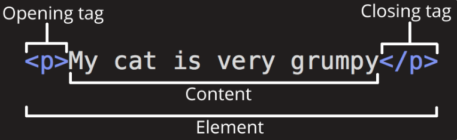
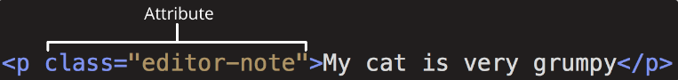

# Html介绍
**HTML**（HyperText Markup Language，**超文本标记语言**）是一种用来告知浏览器**如何组织页面**的标记语言。HTML 可复杂、可简单，一切取决于 web 开发者。HTML 由一系列的元素组成，这些元素可以用来包围或标记不同部分的内容，使其以某种方式呈现或者工作。两端的标签可以使内容变成超链接，以连接到另一个页面；使字体表现为斜体等。
>HTML 标签**不区分大小写**。也就是说，输入标签时既可以使用大写字母也可以使用小写字母。例如，标签 `<title>` 可以写作 `<title>、<TITLE>、<Title>、<TiTlE>` 等，也都可以正常工作。不过，从一致性、可读性来说，最好仅使用小写字母。

# Html元素

这个元素的主要部分有：

- **开始标签**（Opening tag）：包含元素的名称（本例为 p），被左、右角括号所包围。开头标签标志着元素开始或开始生效的地方。在这个示例中，它在段落文本的开始之前。
- **内容**（Content）：元素的内容，本例中就是段落的文本。
- **结束标签**（Closing tag）：与开始标签相似，只是其在元素名之前包含了一个斜杠。这标志着该元素的结束。没有包含关闭标签是一个常见的初学者错误，它可能会产生奇特的结果。

整个元素即指开始标签、内容、结束标签三部分组成的整体。

## 嵌套元素
你也可以把元素放到其他元素之中——这被称作嵌套。如果我们想要表明我们的小猫脾气很暴躁，可以将 very 一词嵌套在 `<strong>` 元素中，意味着这个单词被着重强调：
`<p>My cat is <strong>very</strong> grumpy.</p>`
>**所有的元素都需要正确的打开和关闭，这样才能按你所想的方式展现。**

## 块级元素和内联元素
在 HTML 中有两种你需要知道的重要元素类别，**块级元素**和**内联元素**。

- 块级元素在页面中以块的形式展现。一个块级元素出现在它前面的内容之后的新行上。任何跟在块级元素后面的内容也会出现在新的行上。块级元素通常是页面上的结构元素。例如，一个块级元素可能代表标题、段落、列表、导航菜单或页脚。一个块级元素不会嵌套在一个内联元素里面，但它可能嵌套在另一个块级元素里面。
- 内联元素通常出现在块级元素中并环绕文档内容的一小部分，而不是一整个段落或者一组内容。内联元素不会导致文本换行。它通常与文本一起使用，例如，`<a>` 元素创建一个超链接，`<em>` 和 `<strong>` 等元素创建强调。
  
>备注： HTML5 重新定义了元素的类别：见元素内容分类。尽管这些新的定义更精确，但却比上述的“块级元素”和“内联元素”更难理解，因此在之后的讨论中仍使用旧的定义。

>备注： 在这篇文章中提到的“块”和“内联”，不应该与 CSS 盒子的类型中的同名术语相混淆。尽管它们默认是相关的，但改变 CSS 显示类型并不会改变元素的分类，也不会影响它可以包含和被包含于哪些元素。防止这种混淆也是 HTML5 摒弃这些术语的原因之一。

>备注： 你可以查阅包含了块级元素和内联元素列表的参考页面。参见块级元素和内联元素页面。

## 空元素
不是所有元素都拥有开始标签、内容和结束标签。一些元素只有一个标签，通常用来在此元素所在位置插入/嵌入一些东西。这些元素被称为空元素。例如：元素 `` 是用来在页面插入一张指定的图片。

## 属性
元素也可以拥有属性，属性看起来像这样：


属性包含元素的额外信息，这些信息不会出现在实际的内容中。在上述例子中，这个 class 属性是一个识别名称，以后为元素设置样式信息时更加方便。

属性必须包含：

- 一个空格，它在属性和元素名称之间。如果一个元素具有多个属性，则每个属性之间必须由空格分隔。
- 属性名称，后面跟着一个等于号。
- 一个属性值，由一对引号（""）引起来。

## 布尔属性
有时你会看到没有值的属性，这也是完全可以接受的。这些属性被称为布尔属性。布尔属性只能有一个值，这个值一般与属性名称相同。例如，考虑 disabled 属性，你可以将其分配给表单输入元素。用它来禁用表单输入元素，这样用户就不能输入了。被禁用的元素通常有一个灰色的外观。示例如下：
`<input type="text" disabled="disabled" />`

# 剖析 HTML 文档
单独的 HTML 元素本身并不十分有用。接下来，我们来看看单个元素是如何组合成整个 HTML 页面的：
```html
<!DOCTYPE html>
<html lang="zh-CN">
  <head>
    <meta charset="utf-8" />
    <title>我的测试站点</title>
  </head>
  <body>
    <p>这是我的页面</p>
  </body>
</html>
```
1. `<!DOCTYPE html>`: 声明文档类型。早期的 HTML（大约 1991-1992 年）文档类型声明类似于链接，规定了 HTML 页面必须遵从的良好规则，能自动检测错误和其他有用的东西。
2. `<html></html>`: `<html>` 元素。这个元素包裹了页面中所有的内容，有时被称为根元素。
3. `<head></head>`: `<head>` 元素。这个元素是一个容器，它包含了所有你想包含在 HTML 页面中但不在 HTML 页面中显示的内容。这些内容包括你想在搜索结果中出现的关键字和页面描述、CSS 样式、字符集声明等等。
4. `<meta charset="utf-8">`:`<meta>` 元素。这个元素代表了不能由其他 HTML 元相关元素表示的元数据，比如 `<base>`、`<link>`、`<script>` 、`<style>`或 `<title>`。charset 属性将你的文档的字符集设置为 UTF-8，其中包括绝大多数人类书面语言的大多数字符。有了这个设置，页面现在可以处理它可能包含的任何文本内容。没有理由不对它进行设置，它可以帮助避免以后的一些问题。
5. `<title></title>`: `<title>` 元素。这设置了页面的标题，也就是出现在该页面加载的浏览器标签中的内容。当页面被加入书签时，页面标题也被用来描述该页面。
6. `<body></body>`: `<body>` 元素。包含了你访问页面时所有显示在页面上的内容，包含文本、图片、视频、游戏、可播放音频轨道等等。

# 在 HTML 中包含特殊字符
| 原义字符 | 等价字符引用 |
| ---- | ---- |
| < |`&lt;` |
| > |`&gt;` |
| " |`&quot;` |
| ' |`&apos;` |
| & |`&amp;` |

>备注： 不需要为任何其他符号使用实体引用，因为只要你的 HTML 的字符编码设置为 UTF-8，现代浏览器就能很好地处理实际符号。

# HTML 注释
HTML 拥有在代码中写注释的机制。浏览器会忽略注释，有效地使注释对用户来说不可见。注释的目的是让你在代码中加入注释，以解释你的逻辑或编码。如果你在离开很久后回到一个代码库，以至于你不能完全记住它，这就非常有用。同样，当不同的人在进行修改和更新时，注释也是非常宝贵的。
```html
<p>我在注释外！</p>

<!-- <p>我在注释内！</p> -->
```
